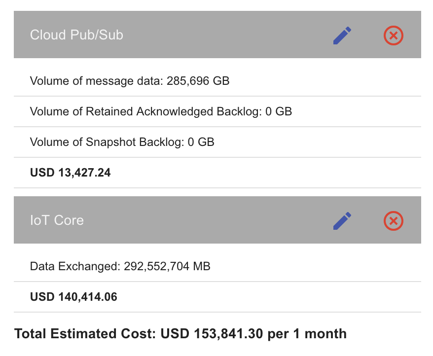
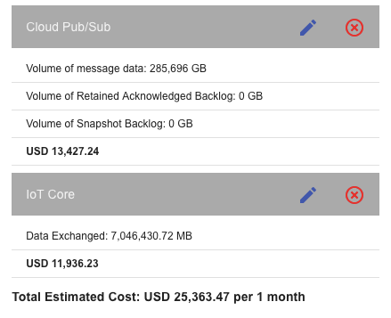
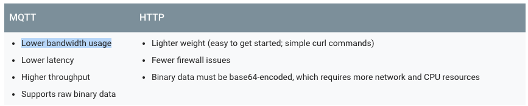
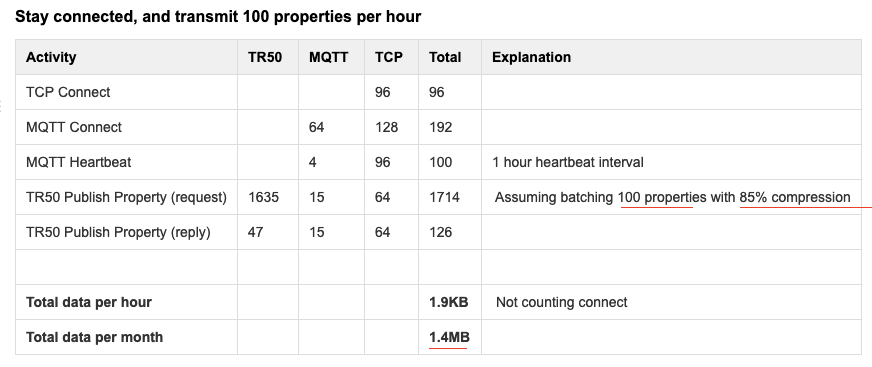
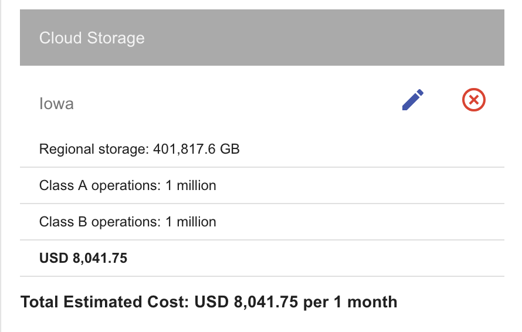
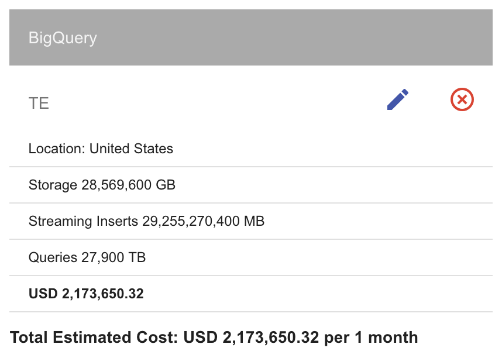
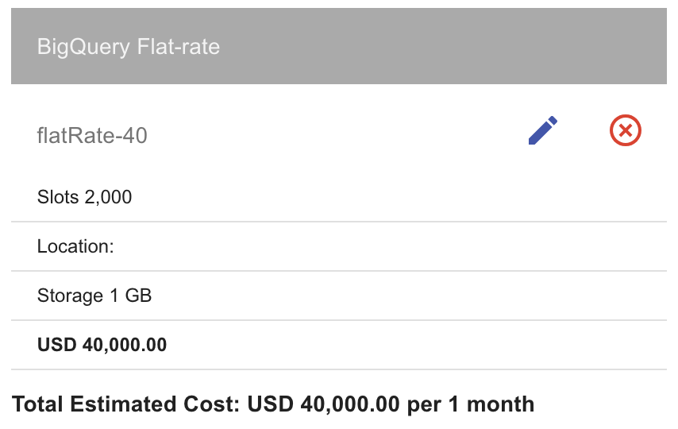
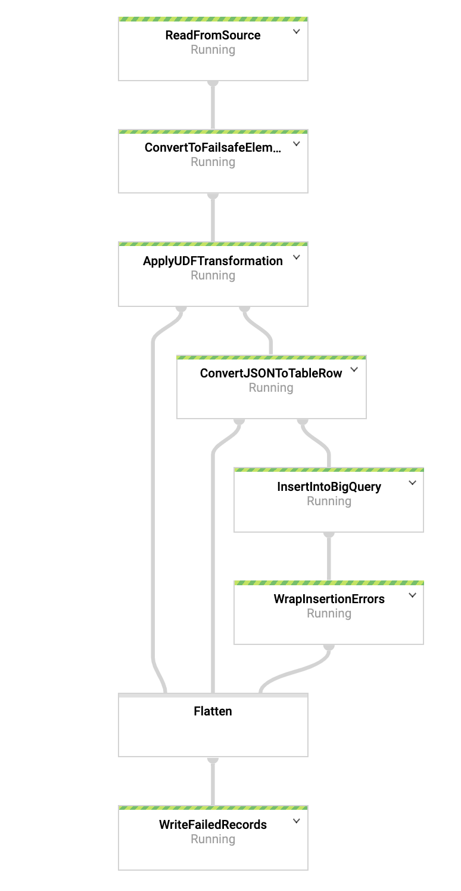
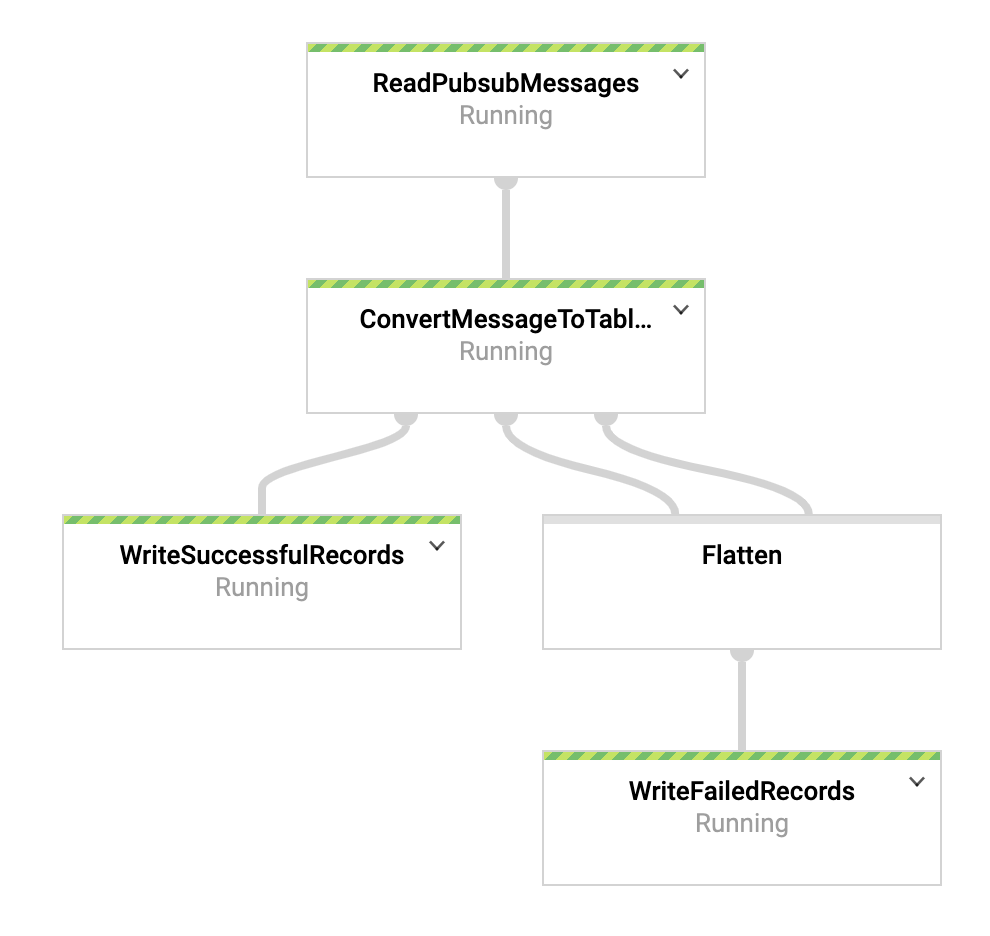

# TerramEarth - Vista técnica a los casos de estudio de la certificación _Professional Cloud Architect_

El objetivo de este artículo no es evitar que tengas que estudiar por tu cuenta los _casos de estudio_, sino ayudarte a ver los múltiples aspectos que se deben tener en cuenta al momento de analizar un proyecto de gran envergadura, y de paso ver las implicancias técnicas detrás de cada uno de los componentes de la solución. Si sigues los pasos descritos, haciendo uso de tu [cuenta gratuita de GCP](https://cloud.google.com/free/), te ayudará a estar mejor preparado para [la certificación](https://cloud.google.com/certification/cloud-architect).

## Caso de Estudio

Lo primero que debes hacer es analizar el caso de estudio de [TerramEarth](https://cloud.google.com/certification/guides/cloud-architect/casestudy-terramearth-rev2/). Este fue recientemente revisado para la actualización del examen que se realizó en Noviembre del 2018.

Para resumir, _TerramEarth_ cuenta con una gran flota de vehículos Agrícolas/Mineros los cuales generan TB de datos por día. El 20% de estos vehículos puede enviar estas métricas mediante conexión inalámbrica, mientras que el resto es enviado cuando el vehículo entra en mantención.

La arquitectura de esta empresa está dividida en dos flujos, el _Batch_ y el _Streaming_, quedando algo similar a la siguiente imagen. Recuerda que esta es una solución tentativa ya que existen muchas forma de implementarla: te invito a ponerla a prueba y encontrar una mejor, te será de mucha ayuda para la certificación.


Ahora te dejaré un listado con cada uno de los componentes principales de la solución y laboratorios (Codelabs y Qwiklabs) para que lo conozcas más de cerca.

* [Cloud Storage](https://codelabs.developers.google.com/codelabs/cloud-upload-objects-to-cloud-storage/index.html?index=..%2F..index)

* [Functions](https://codelabs.developers.google.com/codelabs/cloud-starting-cloudfunctions/index.html?index=..%2F..index)

* [Dataflow Batch](https://www.qwiklabs.com/focuses/3460?catalog_rank=%7B%22rank%22%3A1%2C%22num_filters%22%3A0%2C%22has_search%22%3Atrue%7D&parent=catalog&search_id=2129082)

* [BigQuery](https://codelabs.developers.google.com/codelabs/genomics-vcfbq/index.html?index=..%2F..index)

* [Data Studio](https://www.qwiklabs.com/focuses/1005?catalog_rank=%7B%22rank%22%3A5%2C%22num_filters%22%3A0%2C%22has_search%22%3Atrue%7D&parent=catalog&search_id=2128990)

* [BigQuery ML](https://codelabs.developers.google.com/codelabs/bqml-intro/index.html?index=..%2F..index)

* [IoT Core 1](https://codelabs.developers.google.com/codelabs/iot-data-pipeline/index.html?index=..%2F..index)

* [IoT Core 2](https://codelabs.developers.google.com/codelabs/cloud-iot-core-overview/index.html?index=..%2F..index)

* [Pub/Sub](https://codelabs.developers.google.com/codelabs/cloud-spring-cloud-gcp-pubsub-integration/index.html?index=..%2F..index)

* [Dataflow Streaming](https://gist.github.com/maciekrb/9c73cb94a258e177e023dba9049dda13)

No hagas trampa!, deja de leer y termina los laboratorios :stuck_out_tongue_winking_eye:.

## Del papel a la nube

Si ya hiciste los laboratorios estamos en condiciones de entrar en materia. Vamos a hacer un análisis de cada uno de los pasos necesarios para llevar a TerramEarth a la nube.

Lo primero es establecer el nombre de tu proyecto en GCP para facilitar las cosas. Definamos la variable en nuestro shell:

```sh
TU_PROYECTO=[ACA VA EL ID DE PROYECTO QUE USARAS]
```

### 1) Pre Transferencia
Para el caso de los vehículos que se encuentran desconectados de la red, se espera un inmenso volumen de datos diarios, es por eso que es necesario comprimir los datos antes de subirlos a la nube.

Para ellos utilizaremos datos de ejemplo basados en el esquema de [snon](http://www.snon.org/), puedes revisar el archivo [example.data.json](https://github.com/develasquez/casos-de-estudio/blob/master/TerramEarth/example.data.json) a modo de ejemplo.

Para emular los datos generados por los vehículos, puedes ejecutar el script [generateRandomMetrics.js](https://github.com/develasquez/casos-de-estudio/blob/master/TerramEarth/generateRandomMetrics.js), este generará un archivo llamado `data.json`, con 90000 registros de unos 120 campos cada uno, en un total aproximado de 312 MB.

```sh
#debes tener node.js instalado
node generateRandomMetrics.js > data.json
```

Recuerda que el punto importante en esta etapa es comprimir los datos para reducir los tiempos de transferencia, para ello utilizaremos __gzip__ los que generará un archivo llamado `data.json.gz` que pesará unos 61.3 MB, una reducción superior al 80% del tamaño original. Se puede esperar los mismo en mayores volúmenes de datos, para el caso real de TerramEarth.

```sh
gzip data.json
```
> Páaaaarentesis!
Durante la presentación en vivo de este mini tutorial, alguien (hola alguien!) sugirió utilizar una mejor estrategia de compresión: forzando el nivel de compresión al mejor posible. Bueno, probemos!

Usa por favor el script [compression_comparison.bash](https://github.com/develasquez/casos-de-estudio/blob/master/TerramEarth/compression_comparison.bash). Si cambias el nombre del archivo de datos (asumimos `data.json` si has seguido los pasos), lo puedes pasar como argumento al script.

```sh
% ./compression_comparison.bash
original:
-rw-r--r--  1 thanos  staff  312566824 Mar 22 10:08 data.json

trying gzip default compression level (6)

real  0m12.375s
user  0m9.308s
sys 0m0.531s
-rw-r--r--  1 thanos  staff  61209785 Mar 22 10:08 data.json.gz
trying gzip fastest compression level (1)

real  0m8.593s
user  0m3.751s
sys 0m0.337s
-rw-r--r--  1 thanos  staff  76924569 Mar 22 10:08 data.json.gz
trying gzip max compression level (9)

real  0m28.539s
user  0m24.091s
sys 0m0.943s
-rw-r--r--  1 thanos  staff  59554727 Mar 22 10:08 data.json.gz
```

Como se aprecia, obtenemos esto:

|   | Peso (bytes) | Tiempo (segs) | Compresión |
| :--- | ---: | ---: | ---: |
| data.json | 312566824 | - | - | 0% |
| gz nivel 1 (fastest)  | 76924569  | 3.751 | 75.4% |
| gz nivel 6 (default)  | 61209785 | 9.308 | 80.4% |
| gz nivel 9 (best)  | 59554727 | 24.091 | 80.9% |

Los datos hablan por sí solos no? No hay mucha mejora entre el nivel de compresión por defecto y el máximo (pero más lento), **para este archivo puntual**.

Ok, ya tenemos los datos listos para subir a la nube, a jugar!!!.

### 2) Transferencia

#### Transferencia Batch

Excelente! Ahora subamos esos datos. Hay que tener presente que el método de transferencia no es un juego, y esto es muy importante de cara al examen.

Ten en cuenta que para el caso de TE (TerramEarth) se van a acumular unos __891 TB por día__ y debemos tomar una importante decisión, __¿Qué mecanismo de transferencia utilizaremos?__ Veamos qué nos ofrece Google Cloud.

* __[Transfer Appliance](https://cloud.google.com/transfer-appliance/)__
Este método de transferencia consiste en que Google te envíe un _pendrive_ de unos 100 o 480 TB :stuck_out_tongue_winking_eye:.

Fuera de broma: es un dispositivo rackeable, en el que puedes cargar tu data y enviarla de forma física y segura a Google Cloud. Esto ahorra mucho tiempo de carga, a un costo compuesto entre el valor del servicio (no es gratis) y el transporte desde el país de origen a Google.


Para el caso de TE esta solución no aplica ya que este sistema es para cargas _One Time_, pero TE necesita subir prácticamente todos los días información (generada desde los vehículos que no tienen conectividad para transmitir datos).

* __[Storage Transfer Service](https://cloud.google.com/storage-transfer/docs/overview)__
Este método de transferencia permite importar datos desde sistemas online, los cuales pueden ser [Amazon S3](https://aws.amazon.com/es/s3/), Google Cloud Storage o un origen HTTP/S hasta un Google Cloud Storage dentro de tu proyecto.

Para nuestra solución este mecanismo tampoco nos sirve ya que los datos se encuentran en los servidores físicos de TE y no sería óptimo exponerlos por HTTP/S sólo para poder transferirlos con este mecanismo.

* __[gsutil](https://cloud.google.com/storage/docs/gsutil)__
Esta herramienta es muy versátil y poderosa, está desarrollada en python y te da control absoluto de las acciones que puedes realizar sobre Google Cloud Storage.

Lo que debes tener en cuenta es la velocidad de tu conexión a la red, el volumen de datos y el tiempo que dispones para subirla.
Para ello TE debe utilizar el servicio de [Cloud Interconnect](https://cloud.google.com/hybrid-connectivity/), y elegir un tipo de conexión.

Dale un vistazo a las dos modalidades de [interconnect](https://cloud.google.com/interconnect/docs/how-to/choose-type)

* Dedicated Interconnect
* Partner Interconnect

Imaginemos que TE se va por _Dedicated Interconnect_, con una velocidad de entre 10 Gbps y 80 Gbps (80 Gbps es el máximo permitido). Ahora tengamos las siguientes consideraciones: TE genera __981 TB diarios__ de datos. Si estos son comprimidos con gzip se reducirá teóricamente en un 80% (revisa nuestro apartado anterior donde probamos gzip), quedando un total de __196.2 TB comprimidos__. Dependiendo de la conectividad, la transferencia de este volumen podría demorar entonces entre 60 horas (peor caso) y 4 horas (en el mejor de los casos, con 80 Gbps).


Pero no basta con s´lo tener una buena velocidad, sino que hay estrategias para [optimimizar la transferencia](https://medium.com/google-cloud/google-cloud-storage-large-object-upload-speeds-7339751eaa24), en este caso la más útil es la llamada __[parallel_composite_upload_threshold](https://cloud.google.com/storage/docs/gsutil/commands/cp)__, esto cortará tus archivos en pequeños _chunks_, para aprovechar el envío en paralelo, lo que reduce por mucho el tiempo de subida.


Para hacer la prueba, creemos un _Bucket_ en nuestro proyecto, recuerda que el nombre debe ser único, reemplaza las XXXX por algo mágicamente único.


```sh
BUCKET_NAME=terramearth-batch-XXXX
gsutil mb gs://$BUCKET_NAME

```

Ahora debes dar un valor a __parallel_composite_upload_threshold__ en MB, para nuestro ejemplo probemos con 15MB.

```sh
gsutil -o GSUtil:parallel_composite_upload_threshold=15M cp ./data.json gs://$BUCKET_NAME
```

Esto va a crear múltiples hilos, los cuales subirán nuestro archivo de forma paralela en pequeños chunks de 15MB, realmente hermoso verdad? :open_mouth:.

Ahora veamos cómo sería este proceso de carga de datos para los vehículos que tienen conexión a internet.

#### Transferencia Streaming

Dentro de la flota de TE existe un 20% de vehículos que cuenta con acceso a la red, lo que evita la acumulación de datos, y la necesidad de un proceso masivo. Muy por el contrario, permite que estos datos se puedan procesar en streaming, cada vez que se van generando las muestras de sensores en los vehículos estos son enviados inmediatamente en tiempo real a la nube.

Para esto debemos comprender el concepto de [IoT (Internet of Things)](https://es.wikipedia.org/wiki/Internet_de_las_cosas), el cual busca estandarizar la forma en la que los dispositivos/vehículos/electrodomésticos se comunican y se gestionan a través de la red.

Dentro de los [protocolos](https://cloud.google.com/iot/docs/concepts/protocols) más utilizados para esto se encuentran el [MQTT](http://www.steves-internet-guide.com/mqtt-protocol-messages-overview/) y el HTTP, y el componente que nos permite consumir estos en Google Cloud es [Cloud IoT Core](https://cloud.google.com/iot-core/).

Su funcionamiento en el caso de TE es bi-direccional, ya que permite recopilar los datos desde los vehículos, así como enviar nuevas configuraciones a estos.


Como se aprecia, estos datos en binario viajan haciendo uso de un [tópico](https://cloud.google.com/pubsub/docs/publisher#pubsub-publish-message-nodejs) en [Pub/Sub](https://cloud.google.com/pubsub/) los que crearemos a continuación.

Para crear un registro de IoT core dentro de Google Cloud y poder hacer puebas con este, puedes utilizar el ejemplo que se encuentra en [la carpeta IoT](https://github.com/develasquez/casos-de-estudio/blob/master/TerramEarth/IoT) de este repositorio.

Dado que la seguridad es primordial en la nube, los dispositivos que quieran comunicarse con Cloud IoT core deben hacer uso de tokens JWT, los que deben incluir una clave privada, la cual es validada contra la llave pública almacenada en la configuración de IoT Core.

Para crear tus certificados autofirmados, puedes ejecutar el siguiente comando, aquí te dejo algo de [documentación](https://cloud.google.com/iot/docs/how-tos/credentials/keys) al respecto.

```sh
#si es que estás en otro directorio
#cd IoT/resources;
#este es el comando para generar los certificados
openssl req -x509 -nodes -newkey rsa:2048 -keyout rsa_private.pem -days 1000000 -out rsa_cert.pem -subj "/CN=unused"
```

Lo primero que debes tener en cuenta es que para Cloud IoT Core sólo tienes disponibles tres regiones, `us-central1`, `europe-west1`, y `asia-east1` (a la fecha que redactamos este compendio).

Recuerda que para este caso los [tópicos los debes crear](https://cloud.google.com/sdk/gcloud/reference/pubsub/topics/create?hl=es-419) **antes** que el registro de IoT Core. Estos tópicos serán los encargados de recibir como _eventos_ cada uno de los mensajes que genere el dispositivo.

```sh
gcloud pubsub topics create te-tractor-topic;
gcloud pubsub topics create te-tractor-state-topic;
```


Cloud IoT Core permite la creación de registros para concentrar múltiples dispositivos con un objetivo u operativa en común. En nuestro caso crearemos un registro para los tractores.

```sh
gcloud iot registries create te-tractor \
    --project=${TU_PROYECTO} \
    --region=us-central1 \
    --event-notification-config=topic=te-tractor-topic \
    --state-pubsub-topic=te-tractor-state-topic
```

Ahora debemos crear el dispositivo, es decir, un tractor en particular.

```sh
gcloud iot devices create te-tractor-device \
  --project=${TU_PROYECTO} \
  --region=us-central1 \
  --registry=te-tractor \
  --public-key path=rsa_cert.pem,type=rs256
```

Para emular los datos generados por el tractor he modificado el [código de ejemplo](https://github.com/GoogleCloudPlatform/nodejs-docs-samples/tree/master/iot/mqtt_example) en NodeJs de IoT Core en Github, éste toma el template de los 120 campos en un JSON y los envía por MQTT hacia IoT Core, que finalmente los inyecta en el tópico que creamos en Pub/Sub:

```sh
#vuelve al directoro TerramEarth/IoT
cd ..;
#instalamos las dependencias
npm install
# Emulamos en envio de 10 mensajes desde el tractor, puedes cambiar la cantidad pero creo que con 10 se entiende el concepto

node cloudiot_mqtt_example_nodejs.js mqttDeviceDemo    \
  --projectId=${TU_PROYECTO} \
  --cloudRegion=us-central1 \
  --registryId=te-tractor  \
  --deviceId=te-tractor-device  \
  --privateKeyFile=resources/rsa_private.pem \
  --numMessages=10 \
  --algorithm=RS256
```

Esto funciona de maravillas (aunque no tengas como verlo :sweat_smile:). Si quisieras revisarlo, te recomiendo lo siguiente:

Crea un flujo en [DataFlow usando un template desde PubSub hacia Cloud Storage](https://cloud.google.com/dataflow/docs/guides/templates/provided-templates#cloudpubsubtogcstext), esto creará un flujo en streaming que tomará los eventos enviados y los dejará en un archivo dentro de un bucket. Dado que no es el funcionamiento final que esperamos (no queremos guardar información que va llegando en un bucket), no documentaré el proceso, pero funciona excelente y te animo a probarlo por tu cuenta, en especial considerando que a esta altura estamos ciegos respecto a los mensajes que están llegando al tópico.

Excelente: ya logramos sacar los datos desde nuestros tractores, tanto conectados como desconectados. Pero para TE esto no es barato, en realidad para el volumen de datos que se considera,  es bastante caro.

Por ahora veremos el costo del proceso en streaming y a continuación veremos como abaratar los costos del proceso batch.


#### Hablemos de plata

Lo primero que tienes que tener presente es que si usas [Cloud IoT Core con Cloud Pub/Sub](https://cloud.google.com/iot/pricing), también se te facturará el consumo de recursos de Cloud Pub/Sub por separado.

Vamos a utilizar la [calculadora de precios](https://cloud.google.com/products/calculator/#) de Google Cloud.

Considerando que TE genera __9TB__ de datos por día, podemos entender que generará un total de __279TB__ mensuales. A lo anterior debemos sumar el volumen de datos que se transmitirán por Pub/Sub que también son __279TB__, lo que da un total de __153,841.30 USD__. :scream: más de 150 mil dólares **sólo por el proceso en Streaming**. En la imagen a continuación puedes ver el detalle de cada uno de los componentes:



A mi parecer es muy caro, me hace pensar en que tal vez esos datos son descomprimidos, sin embargo una de las grandes ventajas de MQTT es que es binario y comprime el payload cerca del 85%, lo que baja un poco el total transferido, buscando información encontré un [análisis de MQTT](https://help.devicewise.com/display/ARG/MQTT+data+usage) y su consumo, y justo hay una estimación de 100 propiedades enviadas cada 1 hora, lo que da un aproximado de __1.4MB__ mensual por dispositivo. Si lo multiplicamos por 4 millones de dispositivos (20% del total de la flota) da __5.6TB__ , si recordamos que esto es para 100 campos le agregamos el 20% lo que da __6.72TB__ mensuales a través de MQTT sobre Cloud IoT Core (y llegando a Pub/Sub probablemente ya descomprimido). Así que hagamos otro cálculo:



Esto si me hace más sentido, ya que de la otra forma IoT Core se vuelve inviable, creo, para cualquier compañía.

Así que tengamos en cuenta en nuestras estimaciones que **los datos se reducen al enviarlos por MQTT**. Te dejo los dos pantallazos que me ayudaron a descubrir esto:



Y de este análisis genial en [Device Wise](https://help.devicewise.com/display/ARG/MQTT+data+usage)



Ahora veamos cómo podemos optimizar los costos para el proceso Batch que es 4 veces más grande (voluminoso) que el Streaming.

### 3) Almacenamiento de Archivos

Cada vez que tenemos que almacenar algo en la nube es muy importante que escojamos bien el tipo de almacenamiento que utilizaremos: este puede ser una base de datos en distintos tipos, tanto como un NFS y hasta un sistema de almacenamiento global como Cloud Storage.

Te dejo el [link a la documentación oficial](https://cloud.google.com/storage-options/) y un diagrama de flujo excelente que te ayudará a determinar qué tipo de almacenamiento requiere tu solución. Apréndetelo, para la certificación te servirá mucho.


Para el caso de TE utilizaremos claramente Cloud Storage, pero como ya sabrás existen [4 clases](https://cloud.google.com/storage/docs/storage-classes) de almacenamientos en este producto, y una serie de buenas prácticas que nos permitirán ahorrar unas [moneditas](https://cloud.google.com/storage/pricing) :sweat_smile:.

Te dejo un link a las [buenas prácticas](https://cloud.google.com/storage/docs/best-practices) que debes considerar al utilizar Cloud Storage.

El precio y características de cada una de las clases es el siguiente:

|Storage Class		|SLA	|Precio GB/Mes	|Acceso esperado|
|---				|---:	|---			|---			|
|Multi-Regional		|99.95%	|$0.026			|En caliente	|
|[Dual-Region](https://cloud.google.com/storage/docs/locations#location-dr)*		|99.95%	|$0.026			|En caliente	|
|Regional			|99.9%	|$0.020			|En Caliente	|
|Nearline regional	|99.0%	|$0.010			|Una vez al mes	|
|Coldline regional	|99.0%	|$0.007			|Una vez al año	|

Si te preocupan esos SLA, ten presente que los Storages de Google están diseñados para cumplir un `99.999999999%` (11 9's) de durabilidad anual (logrado gracias al almacenamiento redundante de objetos en múltiples dispositivos a lo largo de múltiples zonas disponibles :dizzy_face:).

#### Estrategia de Storage TerramEarth

A mi parecer la mejor estrategia para este caso es un __Storage Regional__ el cual tendrá un costo de __$0.020__ por Gb almacenado al mes, y una __[política de ciclo de vida](https://cloud.google.com/storage/docs/managing-lifecycles)__ que permita eliminar los archivos. Pero vamos por parte...

* Tipo

Lo primero que tenemos que hacer es cambiar el tipo de Storage desde Multi-Regional a Regional, la documentación oficial [aquí](https://cloud.google.com/storage/docs/changing-storage-classes) indica que debemos hacer lo siguiente:

```sh
gsutil rewrite -s regional -r gs://$BUCKET_NAME/**
```

si bien es lo recomendado, obtuve error:

```
	BadRequestException: 400 The combination of locationConstraint and storageClass you provided is not supported for your project
```

Así que la mejor solución a esta altura es crearlo de cero, directamente regional.

```sh
# Para eliminar el bucket
gsutil rm -r gs://$BUCKET_NAME

# Para crearlo regional en
gsutil mb -c regional -l us-central1 gs://$BUCKET_NAME/
```

Ya tenemos el bucket en la misma región que IoT Core (`us-central1`). Lo que nos queda es crear una política para que elimine los archivos automáticamente, bajo ciertas condiciones.

* Política

Creo que lo mejor es conservar archivos por 2 días (esto en caso que el proceso Batch no funcione a la primera, damos opción a que se pueda reintentar la carga _hu_manualmente al menos). Para ello debemos crear un archivo Json con el siguiente contenido (creo que se explica solo). Y como siempre, aquí te dejo la [documentación oficial al respecto](https://cloud.google.com/storage/docs/managing-lifecycles)

```json
{
	"lifecycle": {
	  "rule": [
	  {
	    "action": {"type": "Delete"},
	    "condition": {
	      "age": 2,
	      "isLive": true
	    }
	  }
	]
	}
}
```

Para aplicar la política debemos usar el siguiente comando:

```sh
gsutil lifecycle set lifecycle.json gs://$BUCKET_NAME
```

Esto nos permitirá controlar un poco el costo ya que los archivos durarán máximo 2 días. Igualmente esto nos mueve un tanto la aguja en los costos así que veamos cuánto sale tener estos datos en Cloud Storage.

* Costos

Recuerda que TE genera un total diario de __196.2TB__ comprimidos, y si estos se mantienen por dos días (por la política de lifecycle previa) tendrás el doble de datos almacenados normalmente, cada día.

Si calculamos el costo de estos datos, __392.4TB__ permanentemente almacenados por mes, en storage regional nos da:



Así es: la pequeña suma de **8 mil dólares** :joy:. De todas formas, es una buena estimación, pues habría sido más caro si no hubiéramos aplicado la _compresión_ (gzip!), el _cambio de clase_ (a regional) y la política de borrado automático (cada dos días).


### 4) Almacenamiento de Datos

Ante de mover los datos desde Pub/Sub y Cloud Storage, debemos pensar en el almacenamiento definitivo de los datos para su análisis, dentro de todos los mecanismos de almacenamiento que tenemos en GCP el más indicado para cumplir con el requerimiento de TE es BigQuery. Pero ¿por qué? ¿qué preguntas te debes hacer para llegar a esta conclusión?.

Te doy un par de tips.

1) __Mira el diagrama de flujo__ que puse antes en la sección de Almacenamiento de Archivos
2) __La relación de los datos__:
	* Si es relacional: Cloud Sql, BigQuery, Spanner
	* Si es **No** Relacional: Datastore, BigTable, Firestore
3) __Piensa en el volumen de datos__:
	* Si es mayor a 10TB descarta Cloud SQL
	* Petabytes? BigQuery, Spanner, BigTable
4) __El uso o consumo__:
	* Si necesitas análisis, descarta Datastore, es poco queriable, no tiene funciones de agregación __SUM__, __AVG__, etc, no tiene __OR__ en los WHERE y tampoco __IN__ (**esta es pregunta de certificación**), y los debes pedir uno a uno (recorrido de tu base es por registro, uno por uno!)
	* Para analítica? por excelencia es BigQuery
	* Realtime? usa Firestore
	* TimeSeries? usa BigTable
5) __Con qué se conecta__:
	* ¿Lo debes conectar a Data Studio? Entonces piensa en Cloud Sql o BigQuery
	* ¿Se conecta a una App Mobile? Firestore por excelencia!
6) __Replicación__:
	* Una Zona? Todas
	* Multi Zona? Cloud SQL
	* Multi Regional? Por excelencia Spanner (por la altísima consistencia, pero es caro caro), BigQuery (en EU ó US), en roadmap se viene Cloud SQL (por ahora no). Si es No SQL, Firestore y Datastore.

Por lo tanto, si el volumen de datos de TE es tan grande, debe ser accedido desde ambas costas de US y su objetivo principal es el análisis, entonces creo que la opción es BigQuery.

__BigQuery__: esta es una poderosa base de datos muy similar a [Apache Hive](https://hive.apache.org/), la que permite consultar sobre Petabytes de datos en segundos. Se podría decir demasiado acerca de esta base de datos, pero no es el objetivo. Te invito a que investigues sus características y limitaciones de cara a la certificación. Pero lo que tienes que saber es que Google le está poniendo todo su cariño a este motor y busca convertirla en un referente del mercado, y eso nos conviene mucho a nosotros (BigQuery hace que el trabajo sea muy fácil para nosotros, y se integra a la perfección el resto de la plataforma GCP).

#### Manos a la Obra

Una de las grandes maravillas de BigQuery es que permite crear nuestros esquemas de base de datos de forma automática tomando como base un archivo, que puede ser CSV, JSON, Avro entre otros. E incluso lo hace si este está comprimido. Una maravilla XD.

Para crear el [esquema de forma automática a partir de el archivo JSON](https://cloud.google.com/bigquery/docs/loading-data-cloud-storage-json#loading_json_data_with_schema_auto-detection) que dejamos en Google Cloud Storage basta con ejecutar el siguiente comando:

```sh
# si seguiste orden hasta acá, debes subir datos de nuevo!
#gsutil cp ./data.json.gz gs://$BUCKET_NAME
# cargar datos en BigQuery
bq --location=US load --autodetect --source_format=NEWLINE_DELIMITED_JSON terramearth.tractordata gs://$BUCKET_NAME/data.json.gz
```

Las ventajas de esto es que no debes complicarte creando el esquema a mano, en especial cuando es tan complejo como es el que queremos almacenar nosotros para TE.

**Importante**: algo que tienes que tener en cuenta es que los datos deben estar en Json **pero delimitados por un salto de línea**, es decir, no es un Array con muchos objetos dentro separados por coma, sino un archivo que tiene un objeto JSON válido por cada línea.

Para ser un buen Arquitecto Cloud debes tener muchas consideraciones en especial con BigQuery, si piensas en la cantidad de datos almacenados, y las veces que se van a consumir, esto puede costarle muy caro a TE. Así que veamos una serie de factores que nos ayudarán a optimizar esos costos. Te dejo un [articulo hermoso aquí](https://medium.com/google-cloud/bigquery-optimized-cluster-your-tables-65e2f684594b), y las [buenas prácticas oficiales acá](https://cloud.google.com/bigquery/docs/best-practices-performance-compute).

* Trata de no transformar datos con la query
* Usa aproximación en las funciones de agregación por ejemplo, en vez de COUNT(DISTINCT), usa APPROX_COUNT_DISTINCT()
* Aplica los filtros antes de ordenar así el ordenamiento se hace sobre menos data
* Clusteriza tus tablas
* Trata de buscar campos relevante para la clusterización, fechas o grupos grandes
* Obliga a que se indique los valores del cluster en la query con `__require_partition_filter=true__`
* En la queries respeta el orden de los clusters
* Normaliza las tablas y usa correctamente los JOINS
* Usa GROUP BYs en base a los campos clusterizados
* Cuotas: puedes establecer límites (medidos en Bytes :scream:) tanto a nivel de Proyectos, Datasets, Usuarios o Grupos (incluso, a nivel de query!)

Si somos descuidados con los precios podemos tener un desastre financiero (y ha pasado :open_mouth:).

Fíjate cuánto saldría si consideramos los 900TB por día por los 31 días del mes, tanto insertados, almacenados y consultados por sólo 1 mes: da **más de 2 millones de dólares**, lo que lo vuelve inviable.



Para que esta locura no ocurra **sigue las buenas prácticas**.

#### La solución al problema

Algo maravilloso que incluyó hace poco BigQuery es la [__Tarifa Plana__](https://cloud.google.com/bigquery/pricing#flat_rate_pricing) seguramente a TE le convenga mucho este enfoque.



Lo único que tendrás que pagar adicional es el almacenamiento, que en este caso para los 27 Mil TB son como `USD 600.000`. Lo que hace pensar en que no se debe almacenar todos los datos, sino __sólo lo que sirva para optimizar la compra de repuestos.__

Otra cosa que recomiendo de cara a la certificación es que estudies los permisos necesarios para usar BigQuery, tanto dentro de tu mismo proyecto como desde un proyecto distinto (**esto me lo preguntaron en la certificación**)

Bueno ya tenemos nuestra tabla en la base de datos, y sólo nos queda mover los datos desde Pub/Sub y Cloud Storage a BigQuery.


### 5) Procesamiento

Vamos muy bien con nuestra implementación profesional de TerramEarth, y no será menos en el procesamiento de datos. Para ello haremos uso de Dataflow, tanto para el proceso Batch como para el basado en eventos/streaming con Pub/Sub.

La mejor ventaja que nos da Cloud Dataflow es que tiene plantillas que abordan los escenarios más comunes de movimiento y transformación de datos.

Para conocerlos mejor entra a la [documentación oficial de los Templates](https://cloud.google.com/dataflow/docs/guides/templates/provided-templates). Los que más nos sirven para este caso son:

* [Cloud Storage to BigQuery - Streaming](https://cloud.google.com/dataflow/docs/guides/templates/provided-templates#cloud-storage-text-to-bigquery-stream): Este es un job en Dataflow que lee desde un origen en Cloud Storage, desde un archivo que esté en formato JSON (que incluso puede estar comprimido) y lo transforma usando UDF para insertarlo en una tabla de BigQuery. La gran ventaja de este template es que es en streaming. Para entenderlo mejor: queda corriendo, y en base a un patrón identifica cuándo se agrega un archivo al bucket, y lo procesa inmediatamente.

Para poder implementar este flujo lo primero que se debe generar es el esquema de destino en la base de datos. Otra vez BigQuery nos hace el trabajo muy fácil! para obtener este esquema basta con ejecutar:

```sh
bq show --format=prettyjson ${TU_PROYECTO}:terramearth.tractordata | jq '.schema.fields'
```

Tomamos el contenido que nos entrega este comando y lo guardamos en un archivo llamado `schema.json` y luego lo subimos a un Storage:

```sh
cd DataFlow;
gsutil mb gs://${BUCKET_NAME}-dataflow

gsutil cp schema.json gs://${BUCKET_NAME}-dataflow/
```

También debemos subir una función de conversión UDF (que en este caso no hace mucho). Pero si quieres reducir los datos que insertas en BigQuery, **este es el lugar indicado**.

```sh
gsutil cp transform.js gs://${BUCKET_NAME}-dataflow/
```

Una vez que tienes los archivos arriba ejecutaremos el Job de Dataflow y lo dejaremos corriendo en espera de nuevos archivos.

```sh
JOB_NAME_GCS=gcs_text_to_bigquery-`date +"%Y%m%d-%H%M%S%z"`

gcloud dataflow jobs run ${JOB_NAME_GCS} \
    --gcs-location gs://dataflow-templates/latest/Stream_GCS_Text_to_BigQuery \
    --parameters \
javascriptTextTransformFunctionName=transform,\
JSONPath=gs://${BUCKET_NAME}-dataflow/schema.json,\
javascriptTextTransformGcsPath=gs://${BUCKET_NAME}-dataflow/transform.js,\
inputFilePattern=gs://${BUCKET_NAME}/*.json.gz,\
outputTable=${TU_PROYECTO}:terramearth.tractordata,\
bigQueryLoadingTemporaryDirectory=gs://${BUCKET_NAME}-dataflow/temp

```
Asi se verá en Dataflow



Y para poder probar si funciona, debemos subir un archivo con nuevos datos, en este caso será el mismo pero con otro nombre, ya que lo que espera el flujo es un archivo que cumpla con el esquema JSON y con el patrón de nombre `\*.json.gz`.


```sh
gsutil cp ./data.json.gz gs://$BUCKET_NAME/data_2.json.gz
```

Si vamos a BigQuery y sacamos un __Count__ deberíamos ver los 90.000 registros iniciales, y al finalizar el proceso deberíamos tener el doble.

```sql
-- reemplaza TU_PROYECTO antes de correr esta consulta!
select count(1) from `${TU_PROYECTO}.terramearth.tractordata`;
```

* [Cloud Pub/Sub to BigQuery - Streaming](https://cloud.google.com/dataflow/docs/guides/templates/provided-templates#cloud-pubsub-to-bigquery) Este es un Job un poco más sencillo, va a leer el tópico de Pub/Sub (en el que escribe Cloud Iot Core) y lo que recibe lo va a insertar en una tabla de BigQuery. Este proceso queda escuchando el tópico, y recibe en Streaming.

Para poder implementarlo es muy sencillo. Ejecuta el siguiente comando:

```sh
JOB_NAME_PUB_SUB=pubsub-to-bigquery-`date +"%Y%m%d-%H%M%S%z"`


gcloud dataflow jobs run ${JOB_NAME_PUB_SUB} \
    --gcs-location gs://dataflow-templates/latest/PubSub_to_BigQuery \
    --parameters \
inputTopic=projects/${TU_PROYECTO}/topics/te-tractor-topic,\
outputTableSpec=${TU_PROYECTO}:terramearth.tractordata

```

Así se ve en Dataflow:



¿Y cómo podemos probar que funciona? Fácil, solo hay que ejecutar el proceso de envío de eventos a IoT Core que usamos al comienzo (dale unos minutos para el flujo levante los workers).

```sh
#vuelve al directoro TerramEarth/IoT
cd ../IoT;

# Emulamos en envio de 10 ensajes desde el tractor, puedes cambiar la cantidad pero creo que con 10 se entiende el concepto.

node cloudiot_mqtt_example_nodejs.js mqttDeviceDemo    \
  --projectId=${TU_PROYECTO} \
  --cloudRegion=us-central1 \
  --registryId=te-tractor  \
  --deviceId=te-tractor-device  \
  --privateKeyFile=resources/rsa_private.pem \
  --numMessages=10 \
  --algorithm=RS256
```


Podemos ver el resultado en BigQuery, debería haber aumentado en 10 la cantidad de registros.

```sql
-- reemplaza TU_PROYECTO antes de correr esta consulta!
select count(1) from `${TU_PROYECTO}.terramearth.tractordata`;
```

¿Viste qué fácil es usar Dataflow con los templates? Ahora bien, si quieres dar tus primeros pasos en Dataflow te recomiendo seguir esta [Guía](https://cloud.google.com/dataflow/docs/quickstarts/quickstart-java-maven).

Y para utilizar Dataflow desde Eclipse con el plugin de GCP debes crear una __cuenta de servicio__, para eso te dejo los comandos y los permisos mínimos necesarios para esto:


```sh
# Crea la cuenta de servicio
gcloud iam service-accounts create dataflow-batch \
	--display-name "dataflow-batch"

# Le asigna los roles necesarios que puede necesitar TE
gcloud projects add-iam-policy-binding ${TU_PROYECTO} \
  --member serviceAccount:dataflow-batch@${TU_PROYECTO}.iam.gserviceaccount.com \
  --role roles/dataflow.admin \
  --role roles/storage.objectAdmin
```

Los Roles que incluye Dataflow Admin son:

* dataflow.<resource-type>.list
* dataflow.<resource-type>.get
* dataflow.jobs.create
* dataflow.jobs.drain
* dataflow.jobs.cancel
* compute.machineTypes.get
* storage.buckets.get
* storage.objects.create
* storage.objects.get
* storage.objects.list

Y se debe agregar permisos para storage

* roles/storage.objectAdmin

Ahora bien, para cargar estas credenciales en Eclipse debes crear una JSON con la Cuenta de Servicio, esto se hace con el sieguente comando:

```sh
gcloud iam service-accounts keys create dataflow_service_account.json \
  --iam-account dataflow-batch@${TU_PROYECTO}.iam.gserviceaccount.com
```

## __En próximas entregas veremos los siguientes puntos__

### 6) Visualización

### 7) Predicción