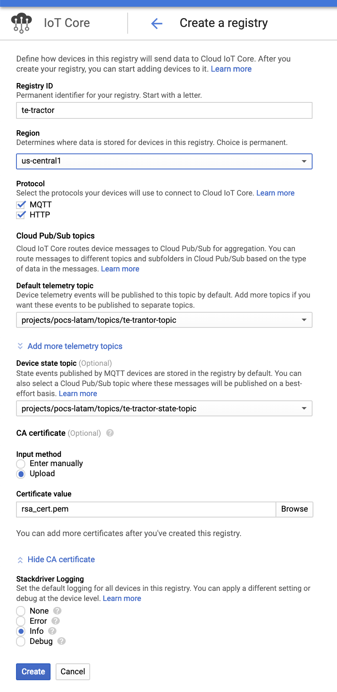

# TerramEarth - Vista técnica a los casos de estudio de la certificación Profesional Cloud Architect 

El objetivo de este articulo no es evitar que tengas que estudiar por tu cuenta los casos de estudio, sino para ayudarte a ver los múltiples aspectos que se deben tener en cuenta al momento de analizar un proyecto de gran envergadura y de paso ver las implicancias técnicas detrás de cada uno de los componentes de la solución. Si sigues los pasos en tu cuenta gratuita de GCP te ayudará a estar mejor preparado para la certificación. 

## Caso de Estudio

Lo primero que debes hacer es analizar el caso de estudio de [TerramEarth](https://cloud.google.com/certification/guides/cloud-architect/casestudy-terramearth-rev2/). Este fue recientemente revisado para la actualización del examen que se realizo en Noviembre del 2018. 

Para resumir, TerramEarth cuanta con una gran flota de vehiculos Agricola/Mineros los cualers generan TB de datos, el 20% de estos vehiculos pueden enviar estos valores mediante conexión inalámbrica, mientras que el resto es enviado cuando el vehiculo entra en mantención.

La arquitectura de esta empresa esta dividida en dos flujos, el Batch y el Steaming, quedando algo similar a la siguiente imágen. Recuerda que esta es una solución tentativa ya que existen muchas forma de implementarla, te invito a ponerla a prueba y encontrar una mejor, te será de ayuda para la Cert.


Segun esto los componentes son los siguientes, cada uno te lleva a un Code Lab o Qwiklab para que experimentes con ellos.


* [Cloud Storage](https://codelabs.developers.google.com/codelabs/cloud-upload-objects-to-cloud-storage/index.html?index=..%2F..index)

* [Functions](https://codelabs.developers.google.com/codelabs/cloud-starting-cloudfunctions/index.html?index=..%2F..index)

* [Dataflow Batch](https://www.qwiklabs.com/focuses/3460?catalog_rank=%7B%22rank%22%3A1%2C%22num_filters%22%3A0%2C%22has_search%22%3Atrue%7D&parent=catalog&search_id=2129082)

* [BigQuery](https://codelabs.developers.google.com/codelabs/genomics-vcfbq/index.html?index=..%2F..index)

* [Data Studio](https://www.qwiklabs.com/focuses/1005?catalog_rank=%7B%22rank%22%3A5%2C%22num_filters%22%3A0%2C%22has_search%22%3Atrue%7D&parent=catalog&search_id=2128990)

* [BigQuery ML](https://codelabs.developers.google.com/codelabs/bqml-intro/index.html?index=..%2F..index)

* [IoT Core 1](https://codelabs.developers.google.com/codelabs/iot-data-pipeline/index.html?index=..%2F..index)

* [IoT Core 2](https://codelabs.developers.google.com/codelabs/cloud-iot-core-overview/index.html?index=..%2F..index)

* [Pub/Sub](https://codelabs.developers.google.com/codelabs/cloud-spring-cloud-gcp-pubsub-integration/index.html?index=..%2F..index)

* [Dataflow Streaming](https://gist.github.com/maciekrb/9c73cb94a258e177e023dba9049dda13)


No hagas trampa, deja de leer y termina los laboratorios XD.

## Del papel a la Nube

Si ya hiciste los labs estas en condiciones de entrar en materia, vamos a hacer un análisis de cada uno de los pasos necesarios para llevar a TerramEarth a la Nube.


### 1) Pre Transferencia
Para el caso de los vehiculos que se encuentran desconectados de la red, se espera un inmenso volúmen de datos diarios, es por eso que es necesario comprimir los datos antes de subirlos a la nube. 

Para ellos utilizaremos a dataos de ejemplo, nos basaremos en el esquema de [snon](http://www.snon.org/), puedes ver el archivo [example.data.json](https://github.com/develasquez/casos-de-estudio/blob/master/TerramEarth/example.data.json) a modod de ejemplo.

Para emular los datos generados por los vehiculos, puedes ejecutar el script getRandomMetrics.js, este generará un archivo llamado data.json, con 90000 registros de unos 120 campos cada uno, un total aprox de 312 MB.

```sh
#debes tener node.js instalado
node getRandomMetrics.js > data.json
```

Recuerda que el punto importante en esta etapa es comprimir los datos pars reducir los tiempos de transferencia, para ello utilizaremos __gzip__ los que generará un archivo llamado _data.json.gz_ que pesará unos 61.3 MB, una reducción superior al 80% del tamaño original. Se puede esperar los mismo en mayores volúmenes de datos, para el caso real de TerramEarth.

```sh
gzip data.json
```

Ok, ya tenemos los datos listos para subir a la nube, a jugar!!.

### 2) Transferencia

#### Tansferencia Batch

Excelente ahora subamos esos datos, pero el metodo de transferencia no es un juego, u esto es muy importante de cara al examen. 
Ten en cuenta que para el case de TE (TerramEarth) se van a acumular unos __891 TB por día__ y debemos tomar una importante desicion.


* __[Transfer Appliance](https://cloud.google.com/transfer-appliance/)__
Este metodo de transferencia consiste en que Google te envie un pendrive de unos 100 o 480 TB, fuera de broma es un dispositivo rackeable, en el que puedes cargar tu data y enviarla de forma física y segura a Google Cloud. Esto ahorra mucho tiempo de carga, a un costo compuesto entre el servicio y el transporte desde el país de origen a Google.


Para el caso de TE esta solución no aplica ya que este sistema es para cargas One Time, pero TE necesita subir casi todos los días.

* __[Storage Transfer Service](https://cloud.google.com/storage-transfer/docs/overview)__
Este metodo de transferencia permite importar datos desde sistemas online, los cuales pueden ser [Amazon S3](https://aws.amazon.com/es/s3/), Google Cloud Storage o un origen HTTP o HTTPS hasta un Google Cloud Storage dentro de tu proyecto.

Para nuestra solución este mecanismo tampoco nos sirve ya que los datos se encuentran en los servidores físiscos de TE y no sería óptimo exponerlos por HTTP/S solo para poder transferirirlos con este mecanismo.


* __[gsutil](https://cloud.google.com/storage/docs/gsutil)__
Esta herramienta es muy versatil y poderosa, esta desarrollada en python y te da control absoluto de las acciones sobre Google Cloud Storage.

Lo que debes tener en cuenta es la velocidad de tu conexion a la red, el volumen de datos y el timepo que subida.
Para ello TE puede utilizar el servicio de [Cloud Interconnect](https://cloud.google.com/hybrid-connectivity/), y debes elegir un tipo de concexión.

Dale un vistazo a las dos modalidades de [interconnect](https://cloud.google.com/interconnect/docs/how-to/choose-type)

* Dedicated Interconnect
* Partner Interconnect

Imaginemos que TE se va por Dedicated interconnect con una velocidad de entre 10 Gbps y 80 Gbps (Máximo permitido). 
Ahora tengamos las siguientes consideraciones, TE genera __981 TB diarios__ de datos, si estos son comprimidos con gzip se reducira tehoricamente en un 80%, quedando un total de __196.2 TB comprimidos__ dependiendo del tipo de concetividad podría demorar entre 60 horas y 4 horas en el mejor de los casos (con 80 Gbps)


Pero no basta con solo tener una buena velocidad, sino que hay estrategias para [optimimizar la transferencia](https://medium.com/google-cloud/google-cloud-storage-large-object-upload-speeds-7339751eaa24), en este caso la más útil es la llamada __[parallel_composite_upload_threshold](https://cloud.google.com/storage/docs/gsutil/commands/cp)__, esto cortará tus archivos en pequeños chuncks, para aprovechar el envio en paralelo, lo que redice por mucho el tiempo de subida. 


Para hacer la prueba, creemos un Bucket en nuestro proyecto, recuerda que el nombre debe ser único, reemplaza las XXXX por algo mágicamente único. 


```sh
BUCKET_NAME=terramearth-batch-XXXX
gsutil mb gs://$BUCKET_NAME

```

Para eso debes dar un valor a __parallel_composite_upload_threshold__ en MB, para nuestro ejemplo probemos con 15MB 

```sh
gsutil -o GSUtil:parallel_composite_upload_threshold=15M cp ./data.json gs://$BUCKET_NAME
```

Esto va a crear múltiples hilos que subirán nuestro archivo de forma paralela en pequeños chunks de 15MB, realemente hermos XD.

Ahora veamos como sería este proceso para los vehiculos que tiene conexion a intenet.

#### Transferencia Streaming

Dentro de la flota de TE existe un 20% de los vehiculos que cuenta con acceso a la red, lo que evita la acomulación de datos para un proceso masivo, sino que permite que estos datos se puedan procesar en streaming, cada vez que se van generando las muestras de los sensores.

Para esto debemos comprender el concepto de [IoT (Internet of Things)](https://es.wikipedia.org/wiki/Internet_de_las_cosas), el cual busca estandarizar la forma en la que los dispositivos/vehiculos/electrodomesticos se comunican y se gestionan a traves de la red.

Dentro de los [protocolos](https://cloud.google.com/iot/docs/concepts/protocols) más utilizados para esto se encuentran el [MQTT](http://www.steves-internet-guide.com/mqtt-protocol-messages-overview/) y el HTTP, y el componente que nos permite consumir estos en Google Cloud es [Cloud IoT Core](https://cloud.google.com/iot-core/)
	
Su funcionamiento en el caso de TE es bi-direccional, ya que permite recopilar los datos desde los vehiculos, asi como enviar nuevas configuraciones a estos.


Como se aprecia, estos datos en binario viajan haciendo uso de un [topico](https://cloud.google.com/pubsub/docs/publisher#pubsub-publish-message-nodejs) en [Pub/Sub](https://cloud.google.com/pubsub/)

Para crear un registro de IoT core dentro de Google Cloud y poder hacer puebas con este puedes utilizar el ejemplo que se encuentra en la carpeta IoT de este repositorio.

Veamos como se crea en la consola de GCP.



Debes crear los tópicos para recibir los mensajes, para recibir el status del dispositivo e ingresar un certificado el cual puedes encontrat en la carpeta IoT/resources/rsa_cert.pem, este es solo un ejemplo, para producción debes ingresar tu propio certificado.


### 3) Almacenamiento
* Tipo
	gsutil rewrite -s [STORAGE_CLASS] gs://[PATH_TO_OBJECT]


* Costo
* Politica
	{
	"lifecycle": {
	  "rule": [
	  {
	    "action": {"type": "Delete"},
	    "condition": {
	      "age": 30,
	      "isLive": true
	    }
	  },
	  {
	    "action": {"type": "Delete"},
	    "condition": {
	      "age": 10,
	      "isLive": false
	    }
	  }
	]
	}
	}
	gsutil lifecycle set [LIFECYCLE_CONFIG_FILE] gs://[BUCKET_NAME]

### 4) Procesamiento 

	TextIO.read().from(filepattern)


* Function
	+ Cantidad de Ejecuciones
* Composer + Dataflow
	+ Workers
* Dataflow
	+ Workers

* Acciones sobre la data
	+ Un Zip
	+ Limpiera
	+ Nutrir
	+ Normalizar v/s D.W
	+ Almacenar
	+ Descartar

### 5) Almacenamiento
* BigQuery
	+ Objetivo
	+ Esquema
	+ Precio
	+ Optimizacion
		- Clusterizacion
	+ Cuotas
	+ Sub Tablas
	+ Permisos desde proyestos externos
* BigTable
	+ Objetivo
	+ Esquema
	+ Precio
	+ Optimizacion
	+ Cuotas
	+ Permisos

### 6) Visualizacion
* Data Studio